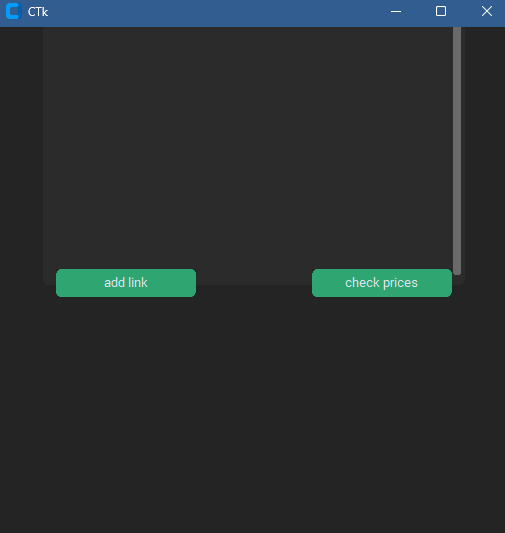
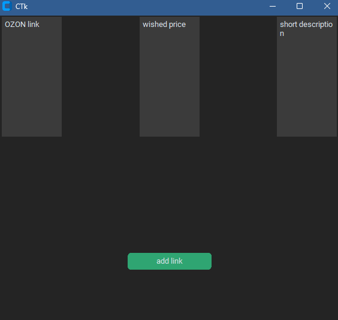
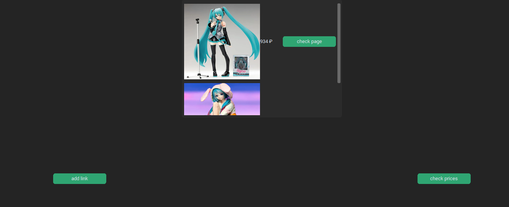

# ozon-parser
simple parser that returns cost and the picture of the item

HOW TO USE:
1)download all librarries and start the code using git or ide
2)choose the "add link button" that showed in the picture

3)add link, wished price and short description if oyu need it

4)return to the first window and press second button to see the current costs and picture in the market

"this projected was created only for educational needs to demonstrate my opportunites, author is not responsible for any use of the script that violates the terms of service (ToS)."
